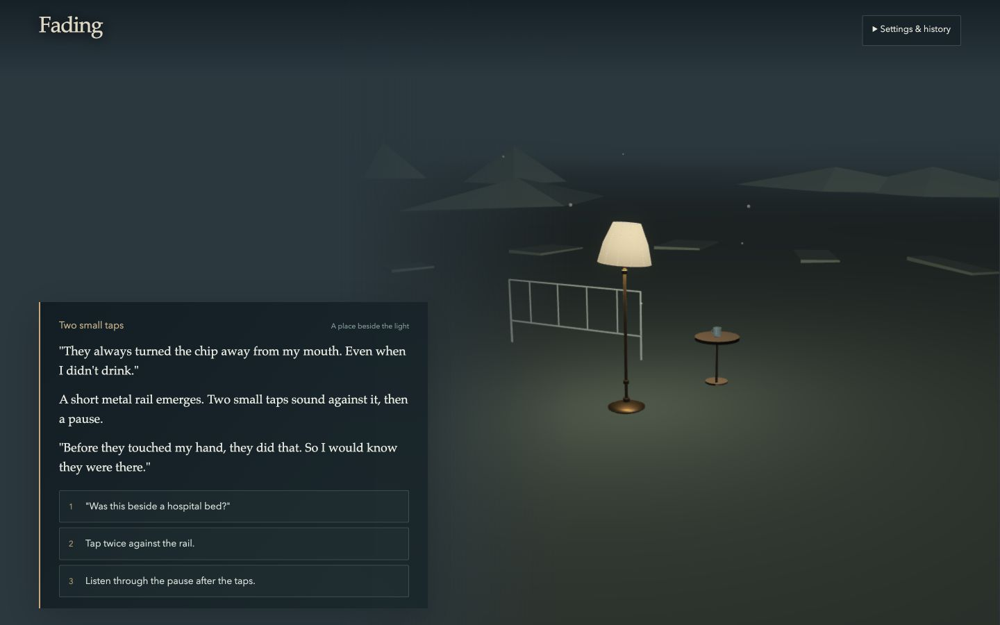
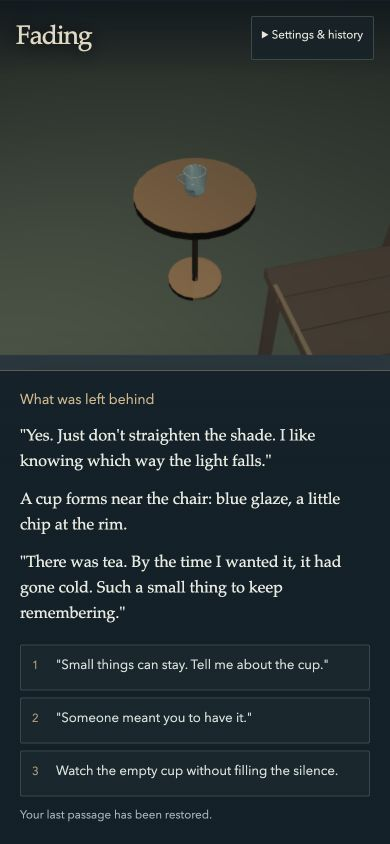
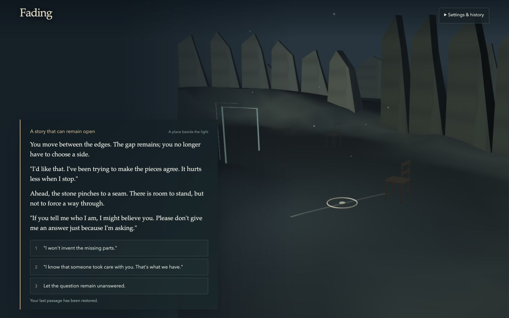
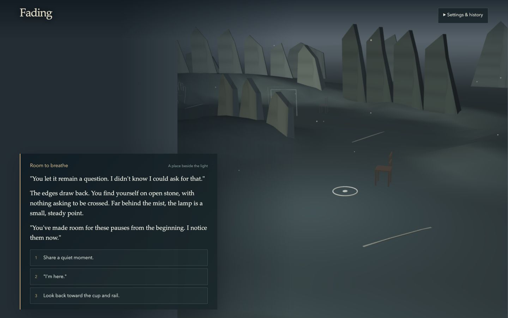

# Fading implementation and verification

3 October 2026. This records the implementation waves following the [baseline critique, SWOT and remedy plan](assessment-and-remedy.md). It is a substantially improved playable chapter, not a claim of AAA production completion. The implementation is prepared for the requested main-branch release; [GitHub Actions](https://github.com/lbsa71/moldy_worldbuilding/actions) records its validation and deployment status.

## What changed

### Living scene production started 5 October 2026

Playtesting found that sound and text sustain an emotional, meditative experience while movement through the crude landscape disrupts it. The [living scene production plan](living-scene-plan.md) supersedes traversal as the target visual direction. It reconstructs the opening image as a fixed scene with deliberate changes in objects and spatial relationships. The current chapter remains available while a separate `/scene-study/` proof is built.

The plan is committed at `3aec137` on `codex/fixed-scene-proof`. New renderer, expression-contract and art-direction work is delegated with distinct file ownership. The [art direction](living-scene-art-direction.md) and [cue sheet](living-scene-cues.md) define the composition and proposed narrative behavior. The existing Blender management chat delivers assets on `codex/living-scene-assets-20261005`; pass05 is now imported after pass01, pass02b, pass03 and pass04, while overall browser fidelity remains unaccepted. The earlier verification records below apply to their respective implementation waves.

The integrated study checkpoint passes **173 tests in 18 files**, type checking with **0 errors and 0 warnings** (24 existing hints), and the production build. Actual browsers exercised WebGPU and explicit WebGL, chair/cup state changes, reset and reduced motion; a 390×844 viewport confirmed accessible controls and normal page scrolling. The verified CC0 HDR environment is used for lighting only. Browser testing exposed a Babylon 7.34.4 lazy shader-registration issue in HDR prefiltering; explicit registration of the installed GLSL/WGSL filtering modules fixes startup in both backends. Regression checks also cover early/late WebGPU startup failure and cancellation, late asset disposal, fog color conversion, and Blender camera data nested beneath its named transform. A context-bound WebGPU failure replaces the canvas before WebGL recovery.

Blender pass01 is imported with editable source, portable maps and a matching manifest: 47,056 triangles, 11 primitives, 8 materials and 21 embedded maps. Independent inspection passes. The review page labels the loaded Blender scene as awaiting fidelity review. Existing bedside assets remain the explicitly provisional fallback. The [corrected browser capture](evidence/living-scene-pass01-calibrated-webgpu.png) and [changed arrangement in WebGL](evidence/living-scene-pass01-changed-webgl.png) demonstrate the interactive proof; they do not meet the opening image's quality. Composition, material credibility and warm-light hierarchy remain rejected by the independent art review. The subsequent Blender revision is recorded below. The renderer chunk-size advisory remains; physical-device performance and photographic fidelity are unverified.

The subsequent pass02b checkpoint imports asset commit `509bb87`, with **all ten checksums valid**, 51,544 triangles, 12 primitives and 22 embedded maps. Its lower camera, vertical chair slats and shorter promontory improve composition. Browser calibration strengthens the existing broad bulb and adds six 256px cube shadow faces with coherent object visibility; Poisson filtering avoids a Babylon 7.34.4 default cube-shadow WGSL compilation defect found in actual WebGPU. Final verification: **174 tests in 18 files**, **0 type-check errors/warnings**, production build, actual WebGPU/WebGL state changes/reset/reduced motion, and no new console errors after the filter correction. See [the browser review page](evidence/living-scene-pass02-review-page.png) and [changed WebGL arrangement](evidence/living-scene-pass02-changed-webgl.png). Warm pool/reflection improves but remains weaker than offline; material and atmospheric fidelity are still unaccepted. Blender production has stopped at this delivery. Physical-device performance, the added shadow cost and portrait composition remain open.

### Sand and towel correction — 5 October 2026

Pass03 from Blender commit `ec162d7` repairs the two defects found in user review. The shore now uses credited CC0 [Sand 03](https://polyhaven.com/a/sand_03) surface maps at physical scale, wet/dry variation and a gentler slope. The towel wraps the top rail with a short front end above the seat, a longer rear end clear of the wood, and hems following the drape. Furniture remains supported during the actual −20° chair turn. Camera, unrelated objects, lighting and application code are unchanged.

The GLB contains **78,988 triangles, 14 primitives, 10 materials and 27 embedded images**, totaling **25,704,764 bytes**. All ten delivery checksums and three sand-source hashes pass. Source and fresh GLB reimport contact checks find **zero cloth/wood crossings**, with **4.624mm minimum clearance**; a deliberately invalid drape correctly fails the validator. The independent GLB inspector, production build and whitespace check pass. This asset-only pass does not rerun or increase the previously passing 174-test application suite.

Actual browser inspection covers opening and turned-chair views in WebGPU and WebGL, cup removal, reduced motion and reset, with no captured warning/error logs. Evidence: [opening](evidence/living-scene-pass03-opening-webgpu.png), [turned WebGPU](evidence/living-scene-pass03-turned-webgpu.png), [turned WebGL](evidence/living-scene-pass03-turned-webgl.png) and [review page](evidence/living-scene-pass03-review-page.png). Independent visual review accepts these two corrections; the front-right waterline's dark edge and the broader material/atmospheric fidelity work remain. Texture memory and physical-device performance are still unmeasured.

### Fractured shore and inhabited inlet — 5 October 2026

User review corrected the shore direction toward the original image's broken black rock and identified the missing books, mountains, settlement and bridge context. Pass04 (`5a5706d`) replaces sand with rough charcoal stone using credited CC0 Seaside Rock maps. Fourteen independent slabs preserve the meaningful breakup of the place; three separate worn books sit beside the chair. Layered terrain, connected bridge banks, grouped cliff buildings and an unlit CC0 cloud dome provide the surrounding setting. The camera and existing furniture, including the corrected towel, are preserved exactly against pass03. Books and slabs remain static, with identities available for later authored changes.

Babylon now honors explicit manifest fog (`.020` in this delivery), excludes the sky from fog/shadows, and includes it in the live mirror. A six-pixel mirror blur softens reflection edges. **176 tests pass in 18 files**, with **six focused surface tests passing after the final blur adjustment**. Final type checking reports **0 errors, 0 warnings and 24 existing hints**; the production build passes with the existing renderer chunk-size advisory. Actual final WebGPU and WebGL review covers opening, turned chair, removed cup, reset and reduced motion without captured warning/error logs.

All nineteen delivery checksums, original scan hashes and generator/module hashes pass; the public and source manifests match. The GLB has **155,600 triangles, 42 primitives, 15 materials, 25 embedded images and 31,827,168 bytes**. The independent GLB inspector reports no issues. Delivered source/reimport validation preserves **zero cloth/wood crossings** and **4.624mm minimum clearance**; books and furniture pass ground-contact checks, and both bridge abutments connect to terrain. The packed `.blend`, source textures and validation reports are retained. Decoded RGBA8 plus mipmaps are estimated at **170.67 MiB**, before runtime targets; physical-device memory and performance are still unmeasured.

Independent art review accepts this bounded correction at study quality: the rough dark shore, identifiable books, enclosing terrain and connected crossing are visible. Photographic fidelity remains unaccepted: cliff buildings merge into a coarse wall, landscape edges and reflections are too crisp, and the bridge reflection forms a conspicuous oval. Large foreground slabs also remain simpler than the reference. Evidence: [opening WebGPU](evidence/living-scene-pass04-opening-webgpu.png), [changed WebGPU](evidence/living-scene-pass04-changed-webgpu.png), [changed WebGL](evidence/living-scene-pass04-changed-webgl.png) and [review page](evidence/living-scene-pass04-review-page.png). The [art brief](living-scene-pass04-art-brief.md) and [coordination record](blender-coordination.md) retain the next fidelity gates. The current chapter remains unchanged.

### Squared floor dissolving into water — 5 October 2026

The pass05 foreground replaces thin paving over a continuous beach with **210 separate, substantial squared rock pieces**. Close-fitting support tiles under the furniture give way to progressively wider water-filled gaps, missing pieces and sparse partly submerged fragments. Rock sides extend beneath the water; the replacement foundation remains entirely submerged. The original rough charcoal maps are retained. Independent review of the actual [browser opening](evidence/living-scene-pass05-opening-webgpu.png) accepts the cubic form and outward progression at normal display size. Fine inner cracks sometimes merge into shadow, but the larger breakup reads clearly.

Camera, furniture, books, backdrop and sky rendering data are preserved against pass04. Babylon code, story and audio are unchanged. Source and reimport validators use explicit contact surfaces on the actual exported blocks, excluding the submerged foundation; they sample the chair at 2° intervals through its 0→−20° turn, plus the existing +20° check, lamp and book undersides. The [coordination record](blender-coordination.md) contains the exact delivery and contact measurements.

The GLB contains **125,828 triangles, 236 primitives, 14 materials, 25 embedded images and 31,446,016 bytes**. Individual block identity increases primitive count from pass04's 42, although triangle count decreases. Desktop WebGPU/WebGL loading, chair turn, cup removal, reduced motion and reset pass without captured console warnings/errors; this is functional verification, not a measured frame-rate or physical-device budget. The independent GLB inspector and production build pass. This asset-only pass does not rerun or increase the prior **176-test** application suite. The existing renderer chunk advisory and broader fidelity/performance gates remain.

Evidence: [opening](evidence/living-scene-pass05-opening-webgpu.png), [changed WebGPU](evidence/living-scene-pass05-changed-webgpu.png), [changed WebGL](evidence/living-scene-pass05-changed-webgl.png) and [review page](evidence/living-scene-pass05-review-page.png). The change is a settled composition; it introduces no time-driven crumbling or narrative penalty.

### Spatial correction — 4 October 2026

The first upgraded version lost an essential part of the original: dialogue was supposed to be a voyage through emotional space. Story coordinates still changed, but camera targets were clamped around the origin and every prop was placed beside the same lamp. That produced a bedside composition instead of a journey.

The correction restores actual camera travel, terrain-relative framing, and distinct places. The lamp remains a fixed point of return; the active memory appears at the current destination, and one subdued motif remains at each visited place. Fractured slate creates shelter, divided sightlines and constriction; lower edges and a broader horizon make quiet and recollection feel open. Sky color and directional lighting change with the emotional state. Six passages vary their approach according to the preceding reply. Keep and rest return to the lamp; carry leads outward. The cup close-up settles only after arrival, so it does not erase the intervening journey.

Reduced motion preserves the same geography while settling movement immediately. Save version 2 stores visited places alongside the Ink checkpoint and rebuilds them on resume. Earlier saves remain under their old key because their internal Ink content indices no longer match the revised script. Terrain sampling replaces per-frame ray tests against the denser ground. No new downloaded or generated media was needed.

The [narrative direction](narrative-direction.md) records the spatial contract and destinations. The verification table below documents the earlier asset-integration wave; spatial-pass verification and images are recorded at the end of this document.

| Area | Delivered behavior |
| --- | --- |
| Narrative | An eleven-decision chapter with specific cup, chair and bedside memories; a contradiction about who brought the tea; callbacks to silence, consent and a chosen keepsake; three equally available resolutions: keep, carry and rest. The old story is preserved separately. |
| Player experience | Semantic HTML dialogue and choices, an authored cup detail view, keyboard navigation and keys 1–4, visible focus, conversation history, text size, sound/volume and reduced motion controls, explicit ending/replay, and local save/resume. Audio and motion preferences persist; text size is session-only. |
| World response | Strict scene, fog, mood, position and object tags; bounded authored positions; a persistent lamp and stable memory-prop identities; a turning chair and different ending light states. Dialogue advances independently of audio loading. |
| Art | A slate-blue, brass and bone palette, staged bedside composition, shared glow, subtle ground texture, restrained dust, original Blender lamp/chair/cup/bedside props and a procedural attention marker. Procedural props remain as loading/failure fallbacks. A generated title illustration establishes the intended atmosphere; it is concept art, separate from the real-time asset study. |
| Music and sound | Four original 48-second synthesized ambient score studies, a recurring two-note motif, a synchronized two-tap rail cue, overlapping score fades, latest-request ownership, and bounded playback with volume, mute, pause and cleanup. No third-party samples. |
| Runtime | WebGPU initialization with WebGL recovery, startup ownership and disposal, renderer resize and tab visibility handling, frame-rate-independent movement, strict story validation and safe restart. |
| Build and delivery | Repaired lockfile, updated root toolchain, lazy game/compiler loading, targeted Babylon imports, release-asset filtering, and CI that validates and deploys the tested artifact. The separate Cloudflare worker remains a further review item. |

Three GPT-6.1 Sol agents at high reasoning handled narrative, runtime and scene work, with the primary agent integrating the interface, score, asset direction, build pipeline and verification. The agents also reviewed each other's interfaces and added focused regression coverage. No more expensive model escalation was needed for this implementation wave.

## Verification performed

| Check | Result and limits |
| --- | --- |
| Clean install | `npm ci --no-fund` succeeded with the updated lockfile. Node 24.13.0 was used locally; the declared minimum is Node 22.12. |
| Automated suite | **133 tests passed in 11 files.** Covers story contract and outcomes, 162 complete mixed-choice histories, save/reset behavior, launch/retry/disposal, movement, visual state, semantic controls, audio races, fades and one-shot cleanup. Added binary GLB integrity/semantic/budget checks and imported-asset cache, fallback, state-continuity and disposal coverage. |
| Type checking | `astro check`: **0 errors, 0 warnings, 25 hints**. Remaining hints are largely unused/unreachable declarations in inherited code. |
| Production build | `npm run validate` passed; production build passed after the Blender integration. Vite reports a chunk-size advisory for the renderer/PBR bundle; see sizes below. `git diff --check` passed. |
| Real browser | Played the original upgraded build through all eleven decisions to the Carry coda, then exercised the Blender build through the Rest coda and restart; verified the selected keepsake callback and dimmed PBR lamp. Also checked save restoration, numeric keyboard choices, settings, reduced motion and mute. Automated story tests cover all three endings; this is not a claim that every path received human playtesting. |
| Responsive presentation | Inspected at 1440×900 and 390×844. Standard-size choices remain visible on the phone layout; 140% dialogue text uses a scrollable panel. These are desktop browser viewport checks, not physical mobile-device validation. |
| Renderer compatibility | Initial WebGPU testing exposed an unsupported RGB raw texture; RGBA fixed it. The Blender wave was then inspected in actual WebGPU and explicit WebGL modes, including PBR lamp emission, model visibility and cup framing. Blocking model URLs verified that procedural fallbacks and choices remain usable. The block was removed after testing. Device-matrix testing remains. |
| Release assets | Inspected the built file list: the reviewed GLBs, new score, tap cue and optimized title image are included with game code. Inherited recordings, images, model and unused WASM are excluded. |
| Blender production | Blender 5.2.2 LTS on the Windows management host generated, rendered and reimport-validated the source and GLBs. The pushed handoff was selectively imported here and every delivered checksum verified. See [coordination](blender-coordination.md) for exact revisions and source provenance. |

### Measured JavaScript payload

Sizes below are local production-file bytes and gzip bytes, not network traces or frame-rate results. Exact hashes may change on subsequent builds.

| Chunk | Minified bytes | Gzip bytes |
| --- | ---: | ---: |
| Babylon, baseline | 5,374,840 | 1,192,920 |
| Babylon, procedural first wave | 1,575,863 | 370,367 |
| Babylon, current with glTF/PBR | 2,150,780 | 504,040 |
| Current launch/interface entry | 16,191 | 5,714 |
| Current lazy game scene | 47,170 | 14,837 |
| Current lazy Ink compiler | 236,915 | 59,529 |

The current renderer/glTF/PBR chunk is approximately **60% smaller** than the baseline, or **58% smaller gzipped**. Supporting the imported materials increased it from the procedural first-wave size; it now exceeds the build's 2 MB chunk advisory threshold. Ink still compiles in the browser after launch; build-time compilation is a worthwhile later improvement. Frame rate, peak memory, thermal behavior and slow-network loading have not yet been benchmarked against agreed target hardware.

## Visual evidence

Actual production-browser screenshots, captured after the changes:

The [title PNG](../public/assets/fading-title.png) and its [full generation prompt and provenance](asset-provenance.md) are separate from this real-time evidence. The active title uses the optimized WebP. All new runtime geometry and score material is project-authored. The consolidated Blender set contains 9,564 triangles, 10 base-pass mesh primitives and 306,720 bytes of GLBs. Those ten primitives exclude scenery, the support table, particles and extra rendering passes; they are not the whole scene's draw-call count. No external asset download was necessary in this wave.

## Remaining production work, in order

1. **Refine the integrated asset study.** The [generator and run instructions](../scripts/blender/README.md) now reproduce reviewed original hero models. The first handoff is integrated, with human-scale staging, optional loading, independent rail/curtain visibility and PBR ending emission. Continue artist review of surfaces, composition, shadows, LODs and close-up detail; measure their device costs before increasing complexity. See [coordination status](blender-coordination.md) for the subsequent primitive consolidation.
2. **Playtest the complete chapter with people.** Check whether the memory contradiction is comprehensible, silence feels acknowledged, the final choice feels earned, and the presence sounds like a person. Revise from observed reactions before adding chapters. Resolve target duration, audience and voice/localization scope.
3. **Finish art and sound with human review.** Refine hero materials, staging, animation and transitions against the actual camera. Listen to all loops, boundaries and transitions on headphones, phone and speakers; replace or refine score studies as needed. Current synthesis is an original working score, not a professionally mastered soundtrack.
4. **Measure target devices and accessibility.** Real WebGPU/WebGL desktop and mobile runs, screen-reader navigation, zoom/reflow, contrast, motion sensitivity, long sessions and repeated restarts. Establish frame, memory and load budgets from measured hardware. DOM controls and viewport checks are a foundation, not an accessibility certification.
5. **Close dependency and provenance gaps.** The root audit fell from 32 findings to two high-severity package entries: `http-cache-semantics` and its affected parent Astro. These represent [one underlying advisory](https://github.com/advisories/GHSA-ch52-4w7c-c8xp), with no patched version published at this check. Npm's proposed force fix would downgrade Astro to 2.10.9. Do not apply that downgrade blindly. The static artifact does not expose Astro's remote-image cache to players, but the dependency advisory remains unresolved. Reassess applicability and a maintained fix before release. Audit the separate worker toolchain and verify the vendored Ink revision/license. Existing unverified media stays out of release output.
6. **Verify production delivery.** The saved Cloudflare token failed direct verification as invalid during release preparation and needs replacement in the repository's `CLOUDFLARE_API_TOKEN` secret. Confirm the resulting GitHub Actions run, R2 serving and cache behavior, exact artifact deployment, failure recovery and rollback. Files are uploaded with HTML last; this is not an atomic deployment transaction. Add release credits and save migration policy before expanding the game.

The [art/audio production brief](art-and-audio-production.md) and [narrative direction](narrative-direction.md) define the next pass. The quality bar remains deliberately ambitious; further content should pass those gates rather than merely increase asset or word count.

## Spatial-pass verification — 4 October 2026

- Automated suite: **148 tests in 12 files**. New coverage exercises actual camera translation, arrival-only detail framing, contrasting camera distance, terrain sampling without per-frame mesh picking, reply-dependent arrival positions, the outward coda, persistent memory traces, trail restoration/rejection, restart cleanup, emotional lighting and landscape resource disposal.
- Type checking: **0 errors, 0 warnings, 24 hints**. Production build passes; the existing renderer chunk-size advisory remains. The final light-intensity adjustment also passed its six focused landscape tests, and the final responsive-sheet adjustment was rebuilt and inspected.
- Actual browser: traversed the chapter to Carry, inspected origin/chair/cup, contradiction/boundary and quiet, restored intermediate and terminal saves, and restarted from the outward coda. Confirmed WebGPU and explicit WebGL rendering; checked reduced-motion arrival and restored normal motion afterward. No captured warning/error messages during these final runs.
- Layout: desktop 1440×900 and phone-width 390×844. The mobile dialogue sheet now matches the camera's reserved 58% height, with longer text scrolling inside it. This remains browser viewport testing, not a physical-device performance or accessibility certification.
- The longer outward coda deliberately traverses the full distance (roughly seven seconds from the crossroads at the current movement speed); reading and replay controls remain responsive throughout.

Additional evidence: [phone-width WebGL scene](evidence/spatial-chair-mobile.png), [outward coda](evidence/spatial-carry-desktop.png), [WebGL coda](evidence/spatial-carry-webgl.png). These are real-time captures of the spatial correction, not concept renders. The spatial chapter is retained on the living-scene work branch for comparison while its replacement is developed.
