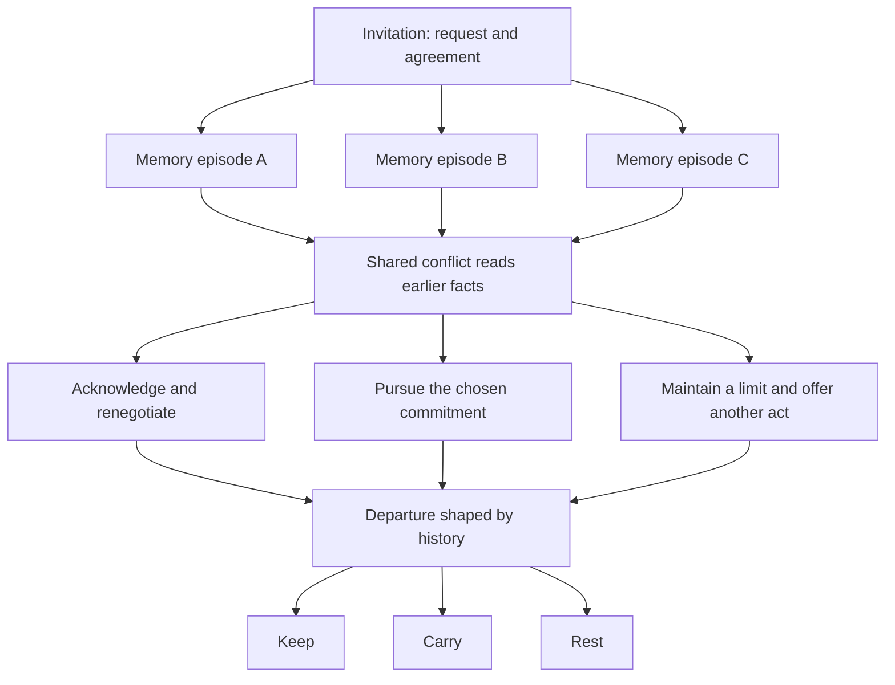

# Fading: narrative hypotheses and production plan

6 October 2026. Target agreed with the user: **30–45 minutes for a first playthrough**. This is a testable design proposal, not a claim that the expanded story or its emotional effects already exist. The accepted scene, sound and current chapter are preserved on `main` at `ac2d314`.

## What we are trying to establish

**A player can become attached to a particular person, choose between competing ways of caring, live with a consequential misunderstanding, and want another visit to explore a different relationship—not merely another final button.**

The original emotional-landscape idea remains central. Its implementation has weakened: the current camera changes attention, but few earlier decisions change what the place makes possible later. The next game should make the same place acquire a history. A return to the chair, cup or rail should expose something the player offered, withheld, promised, misunderstood or relinquished.

The production priority is to test that proposition in one 8–12 minute episode before writing a full-length game. Additional scenic assets are not required for this first experiment.

## Baseline: what the current game actually does

The audit at `ac2d314` found:

- Eleven decisions, three options per decision and twelve displayed beats including the ending. Before the final departure choice, every set of options reconverges at the next knot; the last choice selects one of three terminal codas. There are 33 authored choice edges, not 33 independent story routes.
- In 162 weighted samples representing **81 unique complete choice sequences**, 601–667 narrative words plus 216 displayed choice-label words: **817–883 visible words**. At an explicitly assumed 200 words/minute, that is about 4.1–4.4 minutes of reading, before deliberation. It is not measured playtime or an exhaustive word-count bound across every possible history.
- `connection`, `inquiry` and `hospital_clarity` are written but not read by production Ink. `last_response` usually changes the immediately following reply. Memory flags, silence and accepted uncertainty provide some longer callbacks.
- Selecting a keepsake can establish its memory flag at the end, reducing the distinction between sustained attention and a late selection. The penultimate choice rehearses the same three intentions offered by the final menu.
- The voice usually validates the player's approach. It has little independent agenda, resistance, humour or ability to change its mind. This is an editorial judgement to test, not a measured player finding.
- Existing tests establish technical coverage and restoration. They do not establish attachment, meaningful agency, enjoyment or replay value.

The [reproducible baseline report](evidence/narrative-baseline-ac2d314.json) records the sampling method and source identity. Reproduce it with `npx vitest run scripts/narrative-baseline.test.ts`; updating the report requires the explicit environment flag documented in that audit.

## What “provable” means here

We can verify software properties within an explicit state model: a choice closes a particular opportunity, a promise is remembered, a saved route restores correctly, and an alternative route exposes different content. Those checks must inspect executed outcomes, not just the presence of a variable or tag.

Attachment, regret, curiosity and enjoyment require human evidence. No test suite or agent simulation can prove that everyone will feel them. We can make predictions, fix a test protocol in advance, and reject designs that fail. All thresholds below are **provisional product gates selected for this project**, not published psychological benchmarks or claims of statistical significance.

Use four result states: **untested**, **supported in this pilot**, **revise/reject**, and **inconclusive**. Record sample size, build, condition and contrary evidence. A small successful pilot licenses the next production investment; it does not license a universal claim. Do not move a threshold after seeing a result. Record a new hypothesis version and use fresh evidence if the question changes.

## Hypothesis ledger

All hypotheses below are currently **untested**. The structural baseline above has been measured; there are no invented participant results.

| ID | Prediction | Smallest useful experiment | Predeclared evidence to proceed | Failure response |
| --- | --- | --- | --- | --- |
| H1 — Consequence | A major choice feels consequential when it changes a later possibility as well as the immediate reply. | One episode with three approaches, an immediate response and a consequence at least two decisions later. Compare executed counterfactual routes from the same entrance. | Every nonterminal major option has a tested later witness: a changed available action, access to an episode/evidence, or a commitment that changes what can honestly be offered or refused. Arrangement is supporting feedback, not sufficient by itself. A terminal departure instead has an immediate concrete coda shaped by earlier facts. In a 12-player pilot, at least 9 explain one delayed causal link without being told which choice mattered. | Rewrite the decision or make the later consequence legible. More acknowledgement prose alone does not pass. |
| H2 — Fair difficulty | Players can want two incompatible goods and accept the loss without feeling tricked. | One clearly signalled conflict between comfort, candour and an agreed limit; no timer or hidden roll. Collect immediate post-episode accounts before revealing the design. | At least 9/12 describe both what their choice protected and what it put at risk; at most 2/12 describe its principal consequence as a bait-and-switch. Each alternative has an authored defensible purpose. | Repair framing or causality. Remove arbitrary scarcity. An option that merely says the ethically correct thing more politely is not a difficult choice. |
| H3 — Attachment | A companion with particular wants, contradictions and reciprocal care can sustain attachment and curiosity through an episode. | Give the companion a practical preference, one moment of humour or pleasure, an independent request and a credible refusal within the prototype. | At least 9/12 recall two individual traits or wants; at least 8/12 name an outcome they want for this person and ground it in a specific encounter; at least 9/12 rate “I wanted to see what happened next” 4 or 5 out of 5. | Revise the person and dramatic situation before adding sadness, lore or length. Recall alone is insufficient without interest; these absolute thresholds do not prove improvement over the baseline. |
| H4 — Strategies | Inquiry, reassurance, practical action, presence and limits can each be useful, with usefulness depending on this person's expressed needs and agreements. | Author contrasting requests, including one where quiet helps and another where quiet leaves an explicit request unanswered. Allow approaches to mix; do not assign player classes. | Reachability checks preserve a coherent resolution for every supported approach. At least 9/12 explain why their approach helped in one context and had a limit in another; at most 2/12 infer one always-correct strategy from the game. | Remove the dominant solution or hidden virtue reward. Add clear context, not random reversals designed to defeat the player. |
| H5 — Emotional geography | Persistent arrangements and revisiting a composition make relationship history easier to perceive than passage-specific scenery alone. | Isolate visual consequence: identical writing, audio, choices and cameras; one variant retains action-driven arrangements, the other uses the same neutral arrangement regardless of history. Test paired short scenes with counterbalanced assignment. | Use the same two action-to-later-story links and a 0–2 correct-link rubric in both variants. At least 9/12 score 2 in the responsive version and at least 8/12 improve over their control score; at most 2/12 read brightness or floor integrity as a goodness score. Record visual recognition separately as a manipulation check. | Simplify the spatial vocabulary or remove decorative motion. A tie is inconclusive for added value. A small directional result is not statistical proof of superiority. |
| H6 — Repair | Players understand repair as a new act that can change a relationship without erasing its history or compelling forgiveness. | A disagreement offers acknowledgement, a changed practical act, or a maintained boundary. The companion can decline reconciliation; the game still continues. | At least 9/12 distinguish what repair changed from what it did not undo; at most 2/12 perceive automatic forgiveness or a mandatory apology to obtain the good ending. | Rewrite agency on both sides. Do not turn “apologise” into a state-reset button or make self-erasure the optimal strategy. |
| H7 — Replay | A different approach offers a new encounter and interpretation worth revisiting. | After an ending, offer an optional fork at an earlier decision, with time to stop or explore under identical compensation. Preserve the first run. | At least 6/12 voluntarily start another branch; at least 4/12 finish a new episode and explain one changed interpretation using new evidence. Automated route comparison confirms at least 25% new authored beats on the designated alternative path. | Improve the branch's dramatic difference before adding a completion map or collectibles. Stated willingness and another ending-button click do not count as replay. |
| H8 — Full-length engagement | The completed arc earns 30–45 minutes without padding and leaves an intelligible resolution. | A fresh 12-player full-game pilot after the short episode passes; collect first-run timing, stops and post-run accounts. | At least 9/12 reach a resolution; median active completion time among completers is 30–45 minutes; report all non-completions and elapsed times too. At least 9/12 describe the final consequence of an earlier commitment and rate continued interest at least 4/5. | Shorten repeated material, repair a weak act, or add a missing dramatic development. Never meet the duration target with forced waits, slow text or elongated camera transitions. |

H2 and H3 use retrospective questions in the uninterrupted run. If we need to test pre-choice expectation directly, use a separate comprehension session so prompting and think-aloud do not contaminate natural timing or emotional response. H4 and H6 require the specified contrasting or repair outcomes to have been encountered; their exposure/denominator rules are recorded in the pilot protocol. Missing exposure is inconclusive, not a failure attributed to the player.

The H7 content percentage compares the two episodes from the fork up to, but excluding, their shared rejoin. Let A be the distinct stable beat IDs encountered in the alternate episode and B those encountered in the original episode: novelty = `|A minus B| / |A|`. Count only substantive scene/event differences approved in consequence cards. Conditional prose variants retain their beat ID unless they constitute a separately reviewed dramatic event. Do not create new IDs for paraphrases to meet the threshold. This is a coverage guard, not a substitute for the participant's changed interpretation.

H3's recall, expressed concern and interest are operational proxies for attachment. A passing pilot supports further development; it does not establish a universal internal emotional state. H6 intentionally tests comprehension of repair rather than claiming that every participant found it satisfying.

H5 must use relational cues compatible with both versions' prose, such as the chair's orientation as an invitation. A control must not visibly retain an object the script explicitly says was removed, or otherwise contradict the story. Plot-critical physical actions remain correctly represented in both versions. This isolates the added relationship cues instead of comparing a coherent game with a broken one.

## Ruthlessness: the proposed choice contract

Ruthlessness should come from incompatible commitments, missed opportunities, honest disagreement and irreversible information. The world should not punish a player simply for being quiet, curious or unwilling to touch someone. Equally, being compassionate should not guarantee agreement or remove every cost.

For every major choice, write a **consequence card** before prose production:

1. What the companion has actually requested and what the player already knows.
2. Two or more legitimate values in conflict; the player's intelligible intent in each option.
3. The benefit, foreseeable risk and immediate response.
4. A durable fact, the later beat that reads it, and the opportunity it changes.
5. A visible or audible trace, if it adds meaning rather than merely illustrating mood.
6. A repair or renegotiation possibility, including what cannot be restored.
7. Its effect on departure; a counterfactual test and associated hypothesis IDs.

Expressive choices can remain small. Mark them honestly as expressive in the authoring ledger; do not advertise every line as a plot fork. Every major hinge must satisfy the full contract.

An initial scene to test, not settled canon: **“Tell me I didn't leave her alone.”** The available memory does not establish the answer.

| Response | What it tries to protect | What the next episode must make consequential |
| --- | --- | --- |
| Offer certainty despite the missing evidence. | Immediate comfort and connection. | The companion later relies on the assurance. The player must sustain it or acknowledge having invented certainty; relief cannot make that invention disappear. |
| Offer to examine the painful memory together. | The companion's desire to know and the value of truthful testimony. | Pursuit changes which scene can be reached and what can be said with confidence; an earlier request for rest or agreed stop signal must still matter. |
| Admit uncertainty and offer a concrete act of care. | Honesty, limits and continued companionship. | A practical need can be met while the central question remains unanswered. The companion may find this insufficient; the game cannot automatically praise the response as wisdom. |

The prototype must establish why the question matters and whether inquiry is invited before this scene. This is not three equal rewards, and not an instruction that reassurance, truth or silence is always best. H2 and H4 exist to catch exactly that failure. Where no real opportunity cost follows, do not manufacture one by making the room collapse.

## Shape of a complete 30–45 minute game

Use one continuous encounter with four movements. The companion should have ordinary desires and enough agency to surprise the player. Establish a concrete unfinished task early; resolve what the two people decide to do even if some facts about the past remain uncertain. Care can include humour, competence, relief and mutual recognition as well as grief.

| Movement | Working time budget | Dramatic work | Starting decision budget |
| --- | --- | --- | --- |
| Invitation | 5–7 min | Meet a particular person; establish their request, the player's limits and one agreement worth remembering. | 4–5 |
| Attempt | 9–12 min | Follow one substantial memory episode; try a way of caring; experience pleasure or competence before it is tested. | 6–8 |
| Conflict and revision | 10–15 min | Earlier care fails to meet a new need, or two commitments conflict. A misunderstanding changes what is possible; respond, repair or hold a boundary. | 7–9 |
| Departure | 6–10 min | Act on the relationship actually formed. Resolve the practical task, acknowledge what remains unresolved, and leave a specific final image. | 5–6 |

These add to 30–44 minutes as planning ranges, not runtime timers. Begin with roughly **4,500–6,000 visible words per route**, including choice labels, and 22–28 decisions, of which 6–8 are major hinges. Measure and revise: neither word count nor number of options proves enjoyable duration. Cap the first complete draft at roughly 12,000–16,000 authored words until replay evidence justifies more.

Branch for a substantive episode, then rejoin with memory. The second branch is chosen in the changed context of the first; it is not a fixed personality route.

The three departures remain families of legitimate resolutions. Specific acts can become unavailable for concrete reasons: a destroyed record cannot later be read; a taken cup is not simultaneously left for another arrival; a revoked permission is not silently restored. Always preserve a coherent way onward. Earlier facts change the substance and cost of leaving, not a hidden score that awards the true ending. The final choice cannot overwrite a broken promise.

## The emotional landscape as playable history

Restore the voyage through changes in access, proximity, possession, enclosure and shared attention. Keep the physical lamp as a reliable anchor. A camera cue directs attention; an arrangement records an action; a return to the same framing lets the player read its consequence.

| Anchor | Proposed emotional function | Existing support and bounded next step |
| --- | --- | --- |
| Chair | Availability and invitation: a place offered, negotiated or left open. | Rest/turned orientation exists. Preserve the agreed orientation through later complete scene directions instead of resetting it at each knot. |
| Cup | Particular knowledge, handling, possession and what has been carried away. | Orientation, presence and a seat trace exist. Later dialogue and actions must respect those states. Placing it somewhere new needs contact/animation work. |
| Rail and bedside | A request, a response, and permission to approach. | Stable bedside composition and taps exist. An invitation can be withdrawn in dialogue without inventing an animated hand. |
| Water and shore | Space for uncertainty, distance and departure. | Existing compositions can widen attention or show what is left behind. Quiet is an explicit choice, not an idle timer. |
| Rain | A specific remembered event re-entering the present. | Already script-controlled. Trigger from that memory, never from a generic sadness or failure score. |
| Books, curtain and fractured floor | Privacy, access and incomplete accounts. | Currently static motifs. Opening a book, changing a curtain gap or moving a slab requires new saved states and asset/runtime validation. Test the narrative need before producing these changes. |

The floor's existing dissolution belongs to the place, not to the player's moral performance. Do not destabilise furniture support or increase damage because a player refuses closeness. Changes should settle for reading. Reduced motion preserves every decision and final arrangement. If H5 fails, improve the mapping between action and place before expanding scenery.

## State, replay and guarantees

Replace unused participation totals with a small dictionary of concrete facts: current request; discovered evidence and its certainty; agreement made; permission granted/withdrawn; action completed; unresolved disagreement; repair offered/accepted/declined; object ownership/presence; departure commitment. No single hidden care or trust total should determine all reactions. The companion can trust practical help while disputing a claim about the past.

Keep canonical facts stable between runs. Alternate routes reveal different evidence and relational experiences; do not randomise the truth merely to force replay. An ambiguous fact may remain genuinely unresolved, but ambiguity must not excuse inconsistent writing.

After the first ending, offer optional chapter forks. Restore the actual earlier story snapshot and create a new run, preserving the original ending and transcript. Add stable beat/choice IDs and an exact story-edition ID before implementing this; a visit counter or hand-edited state is not a valid replay checkpoint. An optional map can show visited decisions and unopened branches without ranking endings, revealing future prose or presenting a compulsory 100% target. Current v4 autosave does not yet provide this system.

Release-blocking software checks for the new edition:

- **G1: consequence witnesses.** Execute each major alternative from an identical prefix and verify its specified later effect. A stored flag without an observed consequence fails. Rejoining paths must not erase it.
- **G2: route integrity.** The intended invariant is that every reachable supported state has a coherent continuation and resolution. Preserve explicit uncertainty; reject references to undiscovered evidence, unmade promises or unavailable objects. Exhaustively explore the declared bounded state model and report its limits. Targeted counterfactual fixtures supplement it; where exhaustive checking is impractical, state exactly which paths were tested and retain the uncovered-state risk. A sample must never be reported as a proof about every history.
- **G3: persistence.** At Gate 1, save/resume preserves text, choices, facts, complete presentation and ending, without replaying one-shot sounds. At Gate 4, extend this guarantee to historical checkpoint forks and verify that forking leaves the original run intact.
- **G4: presentation and pace.** Every beat has complete valid cues; motion/audio access settings preserve narrative possibilities. Idle time never changes care, consent or progress. Resource disposal and both rendering backends remain covered.

## Work order and decisions

| Gate | Deliverable | Proceed only when |
| --- | --- | --- |
| 0 — Baseline and specification | This ledger, reproducible baseline, one-page character/situation brief, finite state dictionary and consequence cards for two linked hinges. | There is a clear player task, a companion with an independent want, and no pretend causal link. Baseline data is labelled separately from playtest evidence. |
| 1 — Consequence prototype | One 8–12 minute episode, 6–8 decisions, three substantial approaches, one delayed consequence and one repair/renegotiation. Use current assets and retain the accepted chapter as a control. | G1–G4 for the slice; formative H1–H4 and H6 evidence. If causality or attachment fails, stop expansion and revise the episode. |
| 2 — Spatial experiment | Matched responsive/static arrangement variants; same prose, audio and cameras. | H5 is supported directionally without distraction or moral-score readings. Otherwise simplify the scene response. |
| 3 — Complete draft | Four movements, bounded episode branches, history-dependent departures, authored audio/camera cues. | Structural gates pass and a fresh first-run pilot meets H8. No new asset commission solely to compensate for weak stakes. |
| 4 — Replay and finish | Historical checkpoint forks, preserved runs, optional conversation map; edit repeated prose and mix transitions. | H7, save/fork integrity and final WebGPU/WebGL/accessibility checks. A successful first run must remain satisfying even if the player never replays. |

Run the first prototype as a separate experiment, not a silent replacement of the accepted game. Gate 1 should demonstrate one disagreement that matters; it does not need a complete new plot. Agent roles can stay bounded: one owns scene writing and consequence cards, one owns Ink state/route validation, one owns presentation mappings, and the primary agent integrates and records results. Humans supply the playtest observations.

The [pilot worksheet](playtests/narrative-pilot-01.md) defines recruitment, neutral prompts, measurements and an empty result record. No playtest has yet been run under this protocol.

## Design references and limits

The implementation can use Ink's existing branches, gathers and stateful conditions; [inkle's official guide](https://github.com/inkle/ink/blob/master/Documentation/WritingWithInk.md) documents those mechanisms. No engine replacement is proposed.

The distinction between changing later options, resolving actions and presenting their consequences follows [Emily Short's narrative-system discussion](https://emshort.blog/2022/04/09/what-does-your-narrative-system-need-to-do/). Our specific caring dilemmas, thresholds and production gates are project hypotheses, not results established by that article.
